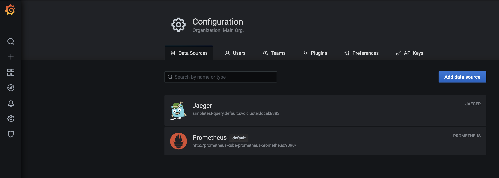

**Note:** For the screenshots, you can store all of your answer images in the `answer-img` directory.

## Verify the monitoring installation

*DONE:* run `kubectl` command to show the running pods and services for the three components. Copy and paste the output or take a screenshot of the output and include it here to verify the installation

- monitoring: 
- observability: 
- default (app): 

## Setup the Jaeger and Prometheus source
*DONE:* Expose Grafana to the internet and then setup Prometheus as a data source. Provide a screenshot of the home page after logging into Grafana.

- grafana datasource: 

## Create a Basic Dashboard
*DONE:* Create a dashboard in Grafana that shows Prometheus as a source. Take a screenshot and include it here.

- basic datasource: 

## Describe SLO/SLI
*DONE:* Describe, in your own words, what the SLIs are, based on an SLO of *monthly uptime* and *request response time*.

Here are 3 definitions from SRE (site reliability engineering):

- SLA or Service Level Agreement is a contract that the service provider promises customers on service availability / uptime, performance, etc.
- SLO or Service Level Objective is a goal that service provider wants to reach.
- SLI or Service Level Indicator is a measurement the service provider uses for the goal. 

SLOs and SLIs are generally for internal only, while SLAs are external.

SLIs based on an SLO of *monthly uptime* and *request response time*:

- SLI (monthly updatime) = total uptime in seconds / total number of seconds in that duration. Duration can be month, hour etc - whatever time we are monitoring our system.
- SLI (request response time) = total time of the duration (say in milliseconds) between receiving a request and returning a response / number of request-response cycles. So, it is average request-response time unit.

## Creating SLI metrics.
*DONE:* It is important to know why we want to measure certain metrics for our customer. Describe in detail 5 metrics to measure these SLIs. 

### Uptime

Definition: This SLI measures what percent of time unit, our service is available. i.e.: 

total uptime in seconds / total number of seconds in that duration
It is needed to make sure that customer is able to access our services. 

### Error rate (500s)

Definition: Number of errors per total number of requests.

Our system may be available, but it is not good if we throw 500s (internal server errors) all the time. To improve our services, we should fix these errors so that the api / service is usable.

### Latency

Definition: Amount of time (say in milliseconds) the service takes to respond or to finish the operation. 

This field is different for different services. For eg. for autosuggest, it should be less than 50 ms but for a normal API it may be like 200 ms, etc. So, SLI can be what percentile of requests meet the Latency of 200 ms. 

### Request count

Definition: This is number of request our service is handling per time unit.

This can be used to see the user patterns, and do the load planning of the service based on that. For eg. if we know, a lot of users are coming to the app in the evening, we can scale the app 5-10 minutes before the high load time and downscale post the load is over. This gives lag-free autoscaling to the system.

### Request-Response time

Definition: total time of the duration (say in milliseconds) between receiving a request and returning a response / number of request-response cycles. So, it is average request-response time unit.

High RRT can result in customers bouncing off the application or higher timeouts, in case it is some backend calling our backend.

## Create a Dashboard to measure our SLIs
*TODO:* Create a dashboard to measure the uptime of the frontend and backend services. We will also want to measure to measure 40x and 50x errors. Create a dashboard that show these values over a 24 hour period and take a screenshot.

## Tracing our Flask App
*TODO:*  We will create a Jaeger span to measure the processes on the backend. Once you fill in the span, provide a screenshot of it here.

## Jaeger in Dashboards
*TODO:* Now that the trace is running, let's add the metric to our current Grafana dashboard. Once this is completed, provide a screenshot of it here.

## Report Error
*TODO:* Using the template below, write a trouble ticket for the developers, to explain the errors that you are seeing (400, 500, latency) and to let them know the file that is causing the issue.

TROUBLE TICKET

Name:

Date:

Subject:

Affected Area:

Severity:

Description:

## Creating SLIs and SLOs
*TODO:* We want to create an SLO guaranteeing that our application has a 99.95% uptime per month. Name three SLIs that you would use to measure the success of this SLO.

## Building KPIs for our plan
*TODO*: Now that we have our SLIs and SLOs, create KPIs to accurately measure these metrics. We will make a dashboard for this, but first write them down here.

## Final Dashboard
*TODO*: Create a Dashboard containing graphs that capture all the metrics of your KPIs and adequately representing your SLIs and SLOs. Include a screenshot of the dashboard here, and write a text description of what graphs are represented in the dashboard.  
