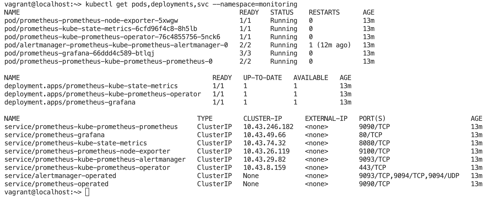
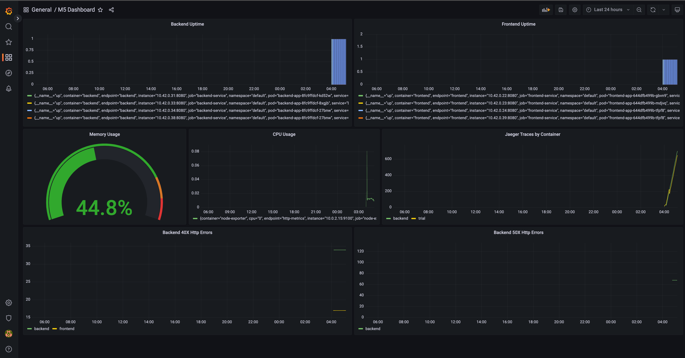

# Cloud Native Metrics Dashboard

**Note:** For the screenshots, you can store all of your answer images in the `answer-img` directory.

## Verify the monitoring installation

*Done:* run `kubectl` command to show the running pods and services for the three components. Copy and paste the output or take a screenshot of the output and include it here to verify the installation

### Monitoring Namespace


### Observability Namespace


### Default Namespace


## Setup the Jaeger and Prometheus source
*DONE:* Expose Grafana to the internet and then setup Prometheus as a data source. Provide a screenshot of the home page after logging into Grafana.

Grafana username: admin, password: prom-operator


## Create a Basic Dashboard

*Done:* Create a dashboard in Grafana that shows Prometheus as a source. Take a screenshot and include it here.
Here is the basic dashboard showing compute resources of K8s pods, with prometheus as datasource:


## Describe SLO/SLI
*Done:* Describe, in your own words, what the SLIs are, based on an SLO of *monthly uptime* and *request response time*.

An SLI (service level indicator) measures compliance with an SLO (service level objective). 
An SLO (service level objective) is an agreement within an Service Level Agreement SLA about a specific metric like uptime or response time.

So, SLO has 2 parts - metric like uptime, etc and time.

For example, if your SLA specifies that your systems will be available 99.95% of the time in December 2022, your SLO is likely 99.95% uptime and your SLI is the actual measurement of your uptime, maybe it’s 99.96%, maybe 99.99% in December 2022. To stay in compliance with your SLA, the SLI will need to meet or exceed the promises made in that document.

In terms of request response time, we can have an SLI of average request response time of 188ms for the month of December 2022, for an SLO of 190ms of request response time for the month of Dec 2022.

## Creating SLI metrics.
*Done:* It is important to know why we want to measure certain metrics for our customer. Describe in detail 5 metrics to measure these SLIs. 

- **Uptime** - It is a direct measurement of our Service Availability during a period of time.
- **Errors** — The number of requests that are failing (such as number of HTTP 500 responses).
- **Latency** — The time taken to serve a request (usually measured in ms).
- **Traffic** — The amount of stress on a system from demand (such as the number of HTTP requests/second).
- **Saturation** — The overall capacity of a service (such as the percentage of memory or CPU used).

## Create a Dashboard to measure our SLIs
*DONE:* Create a dashboard to measure the uptime of the frontend and backend services We will also want to measure to measure 40x and 50x errors. Create a dashboard that show these values over a 24 hour period and take a screenshot.

## Tracing our Flask App
*DONE:*  We will create a Jaeger span to measure the processes on the backend. Once you fill in the span, provide a screenshot of it here. Also provide a (screenshot) sample Python file containing a trace and span code used to perform Jaeger traces on the backend service.

## Jaeger in Dashboards
*DONE:* Now that the trace is running, let's add the metric to our current Grafana dashboard. Once this is completed, provide a screenshot of it here.

## Report Error
*DONE:* Using the template below, write a trouble ticket for the developers, to explain the errors that you are seeing (400, 500, latency) and to let them know the file that is causing the issue also include a screenshot of the tracer span to demonstrate how we can user a tracer to locate errors easily.

TROUBLE TICKET

Name: 500 Server Error on Backend Star API Endpoint

Date: 2 Fe 2022 03:50

Subject: Backend Star API Endpoint throws 500 Error

Affected Area: MongoDB is not setup for the backend API, so /star endpoint fails

Severity: High

Description: MongoDB is down. So, /star endpoint throws 500. Steps to reproduce:
```sh
curl --location --request POST 'localhost:8081/star' \
--header 'Content-Type: application/json' \
--data-raw '{
    "name": "alpha",
    "distance": 2000
}'
```


## Creating SLIs and SLOs
*DONE:* We want to create an SLO guaranteeing that our application has a 99.95% uptime per month. Name three SLIs that you would use to measure the success of this SLO.
- Uptime
- Error rate
- Availability

KPIs follow in next session.
## Building KPIs for our plan
*DONE*: Now that we have our SLIs and SLOs, create KPIs to accurately measure these metrics. We will make a dashboard for this, but first write them down here.
- Uptime: Services should have uptime greater than 99.95%; CPU usage should be below 75%
- Error rate: Error rates like 50x should be less than 99.95. For errors like 40x, we have to check on individual basis, as it can be auth issue or bad request. We will still track 40x.
- Availability: Service should be available and return the right response.
## Final Dashboard
*DONE*: Create a Dashboard containing graphs that capture all the metrics of your KPIs and adequately representing your SLIs and SLOs. Include a screenshot of the dashboard here, and write a text description of what graphs are represented in the dashboard.  


1. Uptime dashboard for the services - backend and frontend
2. Memory and CPU usages ensures we have the uptime. We can also setup alerts on them to mitigate errors
3. Jaeger Traces help us in understanding the app flow, in case of errors. We can also setup to use it for latency
4. Http Errors - 50x ad 40x. 50x are more important, but we should keep 40x also in mind.

## Project Setup

### Build Docker image

```sh
make app-build
```

Push the images:
```sh
make app-up
```

While working on individual part of the app, like say backend, we can run commands like `make backend-up` OR `make backend-fmt` to bring up the service or format the project.
### VM with K8s 

```sh
vg up
```

### Port Forward Grafana and Jaeger Tracker
For Grafana
```sh
kubectl port-forward -n monitoring svc/prometheus-grafana --address 0.0.0.0 3000:80
```

Now, you can access grafana at: <http://127.0.0.1:3000>

Import the dashboard from [here](./reference-dashboards/M5%20Dashboard-1675311735759.json). Then you can access url at: <http://127.0.0.1:3000/d/csms8mA4k/m5-dashboard?orgId=1>.

For Jaeger Tracer:
```sh
kubectl port-forward -n observability  service/simplest-query --address 0.0.0.0 16686:16686
```

Now, you can access Jaeger Tracer at <http://127.0.0.1:16686/>. 

The apps - backend, frontend and trial app are already available in host at 8081, 8080 and 8083 ports.