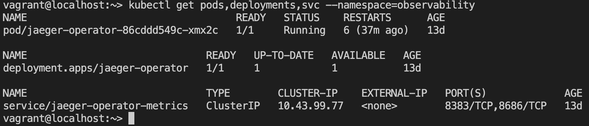
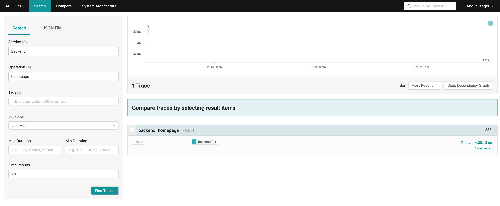

# Cloud Native Metrics Dashboard

**Note:** For the screenshots, you can store all of your answer images in the `answer-img` directory.

## Verify the monitoring installation

*Done:* run `kubectl` command to show the running pods and services for the three components. Copy and paste the output or take a screenshot of the output and include it here to verify the installation

### Monitoring Namespace


### Observability Namespace
This is observability namespace after installing Jaeger operator:

This is observability namespace after install Jaeger app:

### Default Namespace


## Setup the Jaeger and Prometheus source
*DONE:* Expose Grafana to the internet and then setup Prometheus as a data source. Provide a screenshot of the home page after logging into Grafana.

Grafana username: admin, password: prom-operator


## Create a Basic Dashboard

*Done:* Create a dashboard in Grafana that shows Prometheus as a source. Take a screenshot and include it here.
Here is the basic dashboard showing compute resources of K8s pods, with prometheus as datasource:


## Describe SLO/SLI
*Done:* Describe, in your own words, what the SLIs are, based on an SLO of *monthly uptime* and *request response time*.

An SLI (service level indicator) measures compliance with an SLO (service level objective). 
An SLO (service level objective) is an agreement within an Service Level Agreement SLA about a specific metric like uptime or response time.

So, SLO has 2 parts - metric like uptime, etc and time.

For example, if your SLA specifies that your systems will be available 99.95% of the time in December 2022, your SLO is likely 99.95% uptime and your SLI is the actual measurement of your uptime, maybe it’s 99.96%, maybe 99.99% in December 2022. To stay in compliance with your SLA, the SLI will need to meet or exceed the promises made in that document.

In terms of request response time, we can have an SLI of average request response time of 188ms for the month of December 2022, for an SLO of 190ms of request response time for the month of Dec 2022.

## Creating SLI metrics.
*Done:* It is important to know why we want to measure certain metrics for our customer. Describe in detail 5 metrics to measure these SLIs. 

- **Uptime** - It is a direct measurement of our Service Availability during a period of time.
- **Errors** — The number of requests that are failing (such as number of HTTP 500 responses).
- **Latency** — The time taken to serve a request (usually measured in ms).
- **Traffic** — The amount of stress on a system from demand (such as the number of HTTP requests/second).
- **Saturation** — The overall capacity of a service (such as the percentage of memory or CPU used).

## Create a Dashboard to measure our SLIs
*DONE:* Create a dashboard to measure the uptime of the frontend and backend services We will also want to measure to measure 40x and 50x errors. Create a dashboard that show these values over a 24 hour period and take a screenshot.

## Tracing our Flask App
*DONE:*  We will create a Jaeger span to measure the processes on the backend. Once you fill in the span, provide a screenshot of it here. Also provide a (screenshot) sample Python file containing a trace and span code used to perform Jaeger traces on the backend service.

## Jaeger in Dashboards
*DONE:* Now that the trace is running, let's add the metric to our current Grafana dashboard. Once this is completed, provide a screenshot of it here.

## Report Error
*DONE:* Using the template below, write a trouble ticket for the developers, to explain the errors that you are seeing (400, 500, latency) and to let them know the file that is causing the issue also include a screenshot of the tracer span to demonstrate how we can user a tracer to locate errors easily.

TROUBLE TICKET

Name: 500 Server Error on Backend Star API Endpoint

Date: 2 Feb 2023 10:00 am

Subject: Backend Star API Endpoint throws 500 Error

Affected Area: MongoDB is not setup for the backend API, so /star endpoint fails

Severity: High

Description: MongoDB is down. So, /star endpoint throws 500. Steps to reproduce:
```sh
curl --location --request POST 'localhost:8081/star' \
--header 'Content-Type: application/json' \
--data-raw '{
    "name": "alpha",
    "distance": 2000
}'
```
First I saw 50x Panel in the dashboard. Then, I checked the traces:

Then i check the traces:


Then I delve into the pods to see the logs using `kubectl logs --selector app=backend -c backend`.

This is where i see the error:

## Creating SLIs and SLOs
*DONE:* We want to create an SLO guaranteeing that our application has a 99.95% uptime per month. Name four SLIs that you would use to measure the success of this SLO.

1. Application uptime is greater than 99.95%
2. Server resources - memory and cpu usage don't exceed more than 90%
3. Http Error rate 50x and 40x should be less than 95 %
4. 90 % of responses should have average http response time or latency less than 200 ms
## Building KPIs for our plan
*DONE*: Now that we have our SLIs and SLOs, create KPIs to accurately measure these metrics. We will make a dashboard for this, but first write them down here.
- Services should have uptime greater than 99% over the month; 
    - Uptime of services is more than 99%. We are using `up` function in grafana to see uptime of backend and frontend apps
    - Downtime of the services due to deployments or any other reason is less than 1%. 
- Server resources - memory and cpu usage don't exceed more than 90%
    - CPU usage is less than 70% - We track it using `node_cpu_seconds_total` rate over the time
    - Memory usage is less than 70%  - We are `node_memory_MemAvailable_bytes` and `node_memory_MemTotal_bytes` to see how much memory is used 
- Http Error codes 50x and 40x should be less than 99 %   
    - Http error rate is less than 5%. Http 50x status errors should be less than 0.5%. Http 40x For errors like 40x, we have to check on individual basis, as it can be auth issue or bad request. For this project, let Http 40x errors rate is less than 0.05%. We cover it with 3 charts - Http 50x Errors, Http 40x Errors and Http Error rate 
    - Http success rate is more than 99.5%. Chart to cover it - Http Success Rate
    - Jaeger Tracker - to see if get the trace in case of errors (depending on the setup)
- 90% of http request have latency less than 200 ms
    - Average HTTP Request latency is less than 200 ms
    - P95 Latency (95% percentage of requests) have latency less than 200ms
## Final Dashboard
*DONE*: Create a Dashboard containing graphs that capture all the metrics of your KPIs and adequately representing your SLIs and SLOs. Include a screenshot of the dashboard here, and write a text description of what graphs are represented in the dashboard.


The graph below has the following charts:
- Uptime - Frontend and Backend - Tracks the time since our backend and frontend containers are up
- Downtime chart - Tracks percentage of downtime for the detault namespace
- Memory Usage - Tracks CPU usage for our K8s cluster - covers all apps running on it
- CPU Usage - Tracks CPU usage for our K8s Cluster - covers all apps running on it
- Jaeger Trace - Traces shown by Jaeger over time
- HTTP 5xx Error - This displays the number of 5xx status codes for all containers - backend, frontend and trial.
- HTTP 4xx Errors - This displays the number of 4xx status codes for all containers -  backend, frontend and trial
- Http Error Rate - Measures percentage of errors over time for the backend, trial and frontend services
- Http Success Rate - Measures percentage of success over time for the backend, trial and frontend services
- Http Request Latency - Measures average latency of the flask apps over time
- P95 Request Latency - Measures that 95% of the requests have latency less than 200ms.
## Project Setup

### Build Docker image

```sh
make app-build
```

Push the images:
```sh
make app-up
```

While working on individual part of the app, like say backend, we can run commands like `make backend-up` OR `make backend-fmt` to bring up the service or format the project.
### VM with K8s 

```sh
vg up
```

### Port Forward Grafana and Jaeger Tracker

First step:
```sh
vagrant ssh
```
For Grafana
```sh
kubectl port-forward -n monitoring svc/prometheus-grafana --address 0.0.0.0 3000:80
```

Now, you can access grafana at: <http://127.0.0.1:3000>

Import the dashboard from [here](./reference-dashboards/M5%20Dashboard-1675311735759.json). Then you can access url at: <http://127.0.0.1:3000/d/csms8mA4k/m5-dashboard?orgId=1>.

For Jaeger Tracer:
```sh
kubectl port-forward -n observability  service/simplest-query --address 0.0.0.0 16686:16686
```

Now, you can access Jaeger Tracer at <http://127.0.0.1:16686/>. 

The apps - backend, frontend and trial app are already available in host at 8081, 8080 and 8083 ports.
